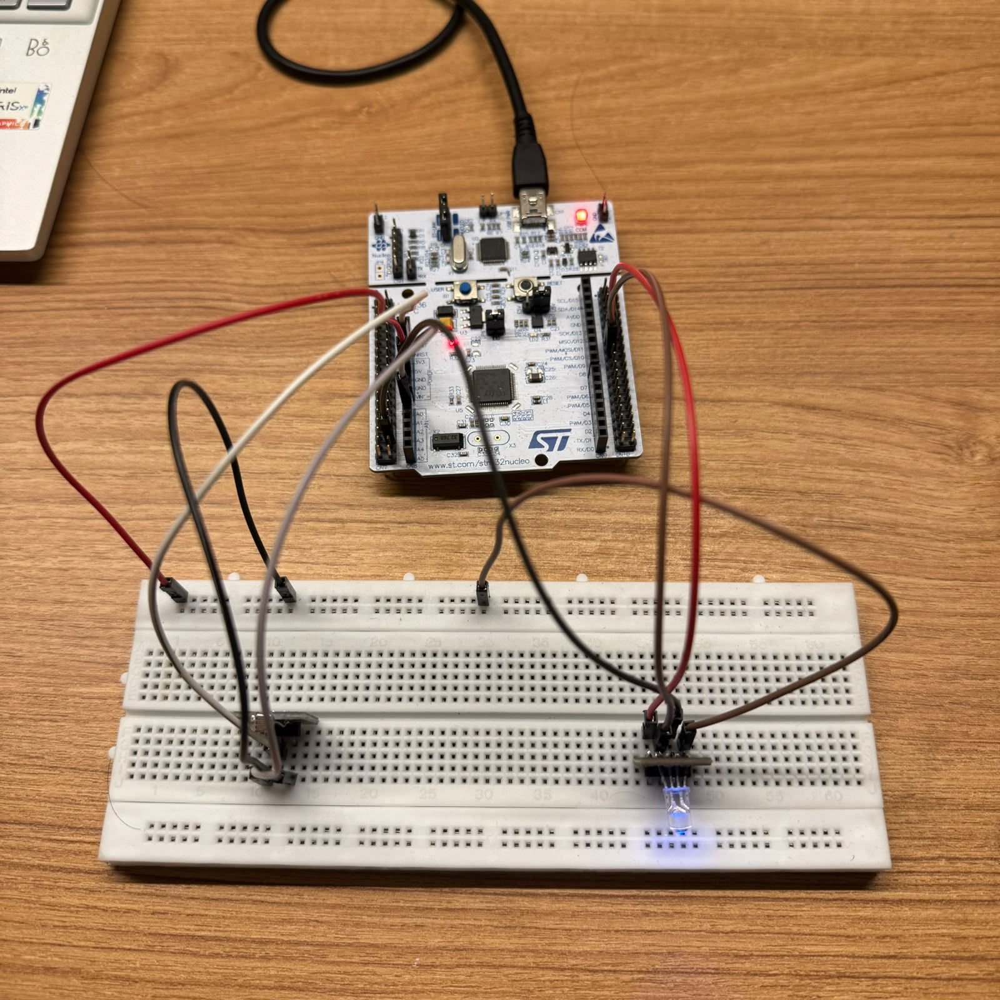
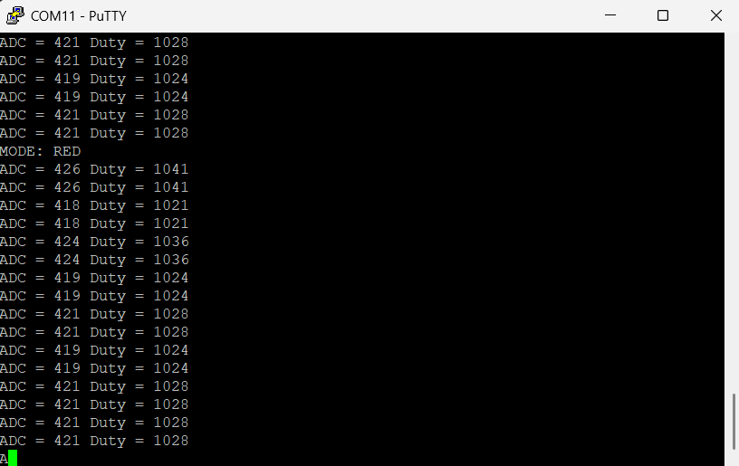

# STM32 Smart Ambient Light Controlled RGB Lamp

## Overview

This project implements a **Smart Ambient Light Controlled RGB Lamp** using the **STM32 Nucleo-F446RE** development board. The system measures ambient light intensity using an LDR (Light Dependent Resistor) and automatically adjusts the brightness of an RGB LED using PWM. A push button allows the user to switch between different LED color modes, while UART communication provides real-time monitoring of sensor readings and system status.

---

## Objective

The objective of this project is to demonstrate the integration of multiple STM32 peripherals by developing a real-time ambient light monitoring system that automatically controls the brightness of an RGB LED using PWM.

---

## Features

- 🌞 Ambient light sensing using an LDR
- 🎨 RGB LED brightness control using PWM
- ⏱️ Periodic sensor sampling using TIM2 interrupts (100 ms)
- 🔘 Push-button based color mode selection using EXTI
- 🛡️ Software debounce for reliable button operation
- 📡 UART communication for real-time monitoring
- ⚡ Interrupt-driven embedded application using STM32 HAL

---

## Hardware Used

- STM32 Nucleo-F446RE
- LDR (Light Dependent Resistor)
- RGB LED (Common Cathode)
- Push Button
- Breadboard
- Mini-USB to USB Type-A cable
- Jumper Wires
- PC

---

## Software Used

- STM32CubeMX
- STM32CubeIDE
- STM32 HAL Drivers
- PuTTY / Tera Term (UART Monitoring)

---

## STM32 Peripherals Used

| Peripheral | Purpose |
|------------|---------|
| GPIO | Button and LED connections |
| ADC1 | LDR analog input |
| TIM2 | 100 ms periodic interrupt |
| TIM3 | PWM generation for RGB LED |
| USART2 | UART communication |
| EXTI | Push-button interrupt |

---

## Pin Configuration

| Pin | Function |
|-----|----------|
| PA0 | ADC1 Input (LDR) |
| PA6 | TIM3 Channel 1 (PWM) |
| PA7 | TIM3 Channel 2 (PWM) |
| PB0 | TIM3 Channel 3 (PWM) |
| PA2 | USART2 TX |
| PA3 | USART2 RX |
| PC13 | Push Button (EXTI) |

---

## Project Working

1. TIM2 generates an interrupt every **100 ms**.
2. The LDR value is sampled using **ADC1**.
3. The ADC value is converted into a PWM duty cycle.
4. PWM duty cycle controls the brightness of the RGB LED.
5. Pressing the push button cycles through:
   - White
   - Red
   - Green
   - Blue
6. ADC value, PWM duty cycle, and operating mode are transmitted over UART for monitoring.

---

## Hardware Setup

The figure below shows the complete hardware setup of the Smart Ambient Light Controlled RGB Lamp.



---

## UART Output

The UART terminal displays the real-time ADC reading, calculated PWM duty cycle, and the selected operating mode.



---

## Operating Modes

| Mode | Description |
|------|-------------|
| White | All RGB channels are active |
| Red | Red channel only |
| Green | Green channel only |
| Blue | Blue channel only |

---

## Demonstration

The system continuously monitors the ambient light intensity using an LDR and automatically adjusts the brightness of the RGB LED through PWM. The push button cycles through White, Red, Green, and Blue operating modes. Real-time ADC readings, PWM duty cycle, and the selected operating mode are displayed on the PC through UART.

---

## Skills Demonstrated

- Embedded C Programming
- STM32 HAL Driver Development
- GPIO Configuration
- ADC Interfacing
- PWM Generation
- Timer Interrupts
- External Interrupts (EXTI)
- UART Communication
- Real-Time Embedded Systems
- Sensor Interfacing
- Interrupt-Driven Programming

---

## Project Structure

```
Mini_Project/
│
├── Core/
├── Drivers/
├── Mini_Project.ioc
├── README.md
└── .gitignore
```

---

## Future Improvements

- Interface a DHT11 sensor for temperature and humidity monitoring.
- Add SPI/I²C sensors such as BMP280.
- Implement UART command-based control.
- Add SD card data logging.
- Integrate an OLED display.
- Implement DMA for efficient data acquisition.

---

## Author

**Atharva Vemulapalli**

B.E. Electronics and Communication Engineering  
BITS Pilani, Hyderabad Campus

---

## License

This project is intended for educational and learning purposes.
